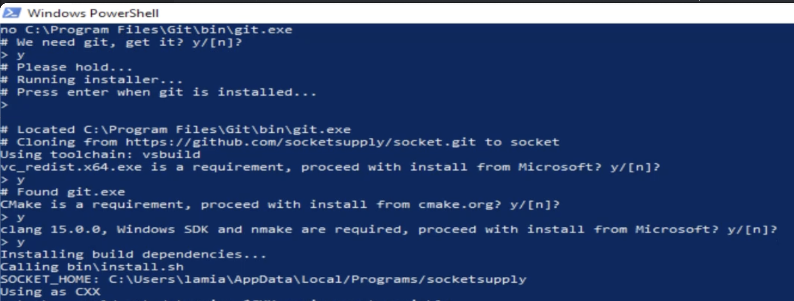
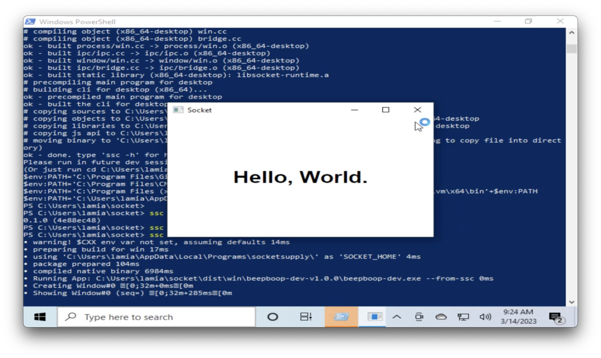
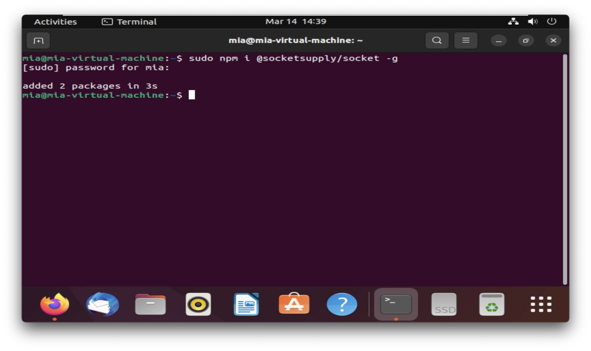

# Desktop Guide

 ## 1- Windows 

This guide shows how to set up your development environment, all the requirements needed, and step by step  
on how to build `Socket` app displaying `Hello, Word.` on Windows 10

## Getting Started

### Requirements
To develop apps for Windows 10 you need:
* [Windows](https://www.microsoft.com/en-us/windows/) 10
* [Visual Studio](https://visualstudio.microsoft.com/downloads/) 2022

### Installing SSC and building dependencies

After downloading and installing `Visual studio`, you can run any of the [Windows](./guide-fte#install) commands
to get `SSC` installed.  

  


If you don't have `Git`, `CMake`, and `Clang 15.0.0`installed already on your  
machine, it will prompt you to install them, just hit `y`.  



After installing all of the above, you should be able to `cd socket` and run   
```
.\bin\install\ps1
```
to install the build dependencies.  

You are all set, you can now check that `ssc` is installed by 
running 
```
ssc --version
```

### Build Socket app  

Before building the app, you need to open `socket` directory and run:

```
ssc init
```
you are now ready to use the `build` command. Enter the following command on your terminal :
```
ssc build -r -o
```


If you encounter any issues you can check [Windows troubleshooting](./troubleshooting#Windows) or you can ask your questions on our [Discord](https://discord.com/invite/YPV32gKCsH)


## 2-Linux  

To get started, open your terminal and run  
```
sudo apt install \
  build-essential \
  clang-14 \
  libwebkit2gtk-4.1-dev
  ```
  

Next, you can install `ssc` on Linux by running one of the command in the
`Install From Package Manage`(./guide-fte.md#install).
 
`note`: if you choose `npm` package manager, you may need to run the command with elevated privileges, prefix `sudo` with the Linux command :
```
sudo npm i @socketsupply/socket -g
```


  ## Build the app  

Open `socket` directory and run:

```
ssc init
```
 Enter the following command on your terminal to build the app :
```
ssc build -r -o
``` 
All done!

If you have any issues during the installation or building, you can check 
[Linux troubleshooting](./troubleshooting#linux).
If you are still stuck we can help [Here](https://discord.com/invite/YPV32gKCsH)